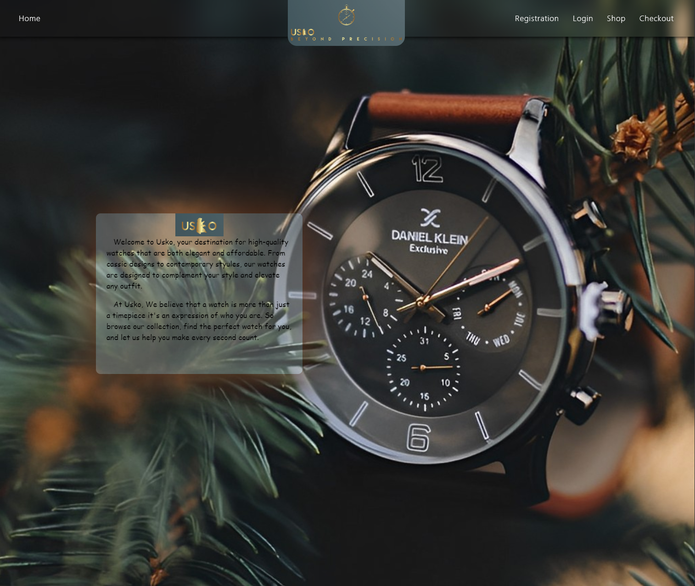
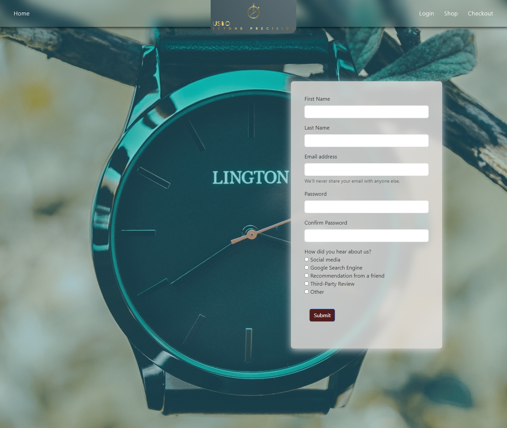
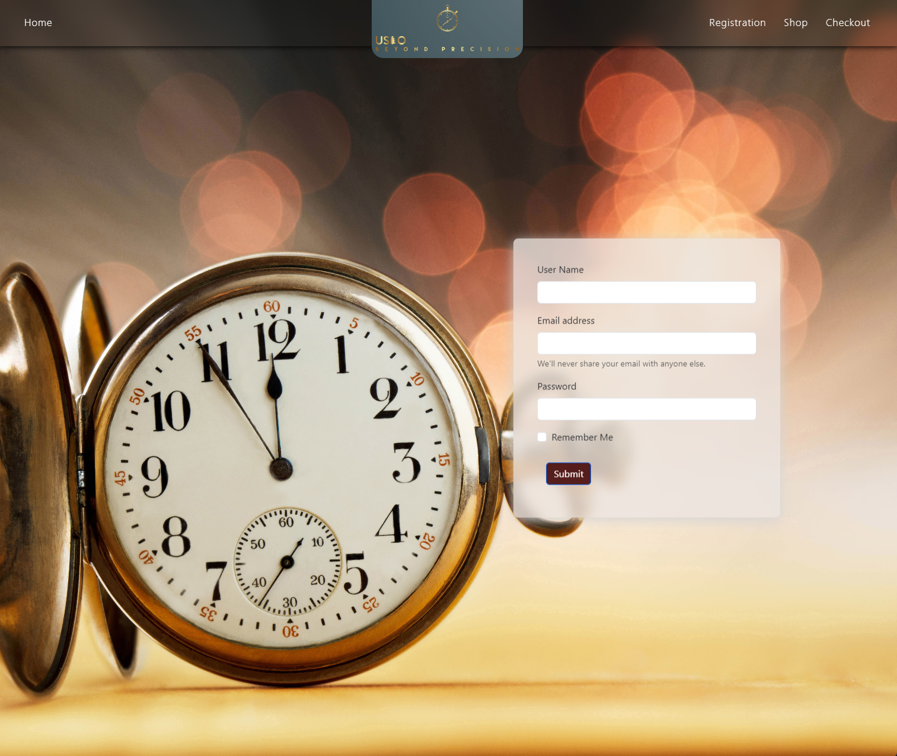
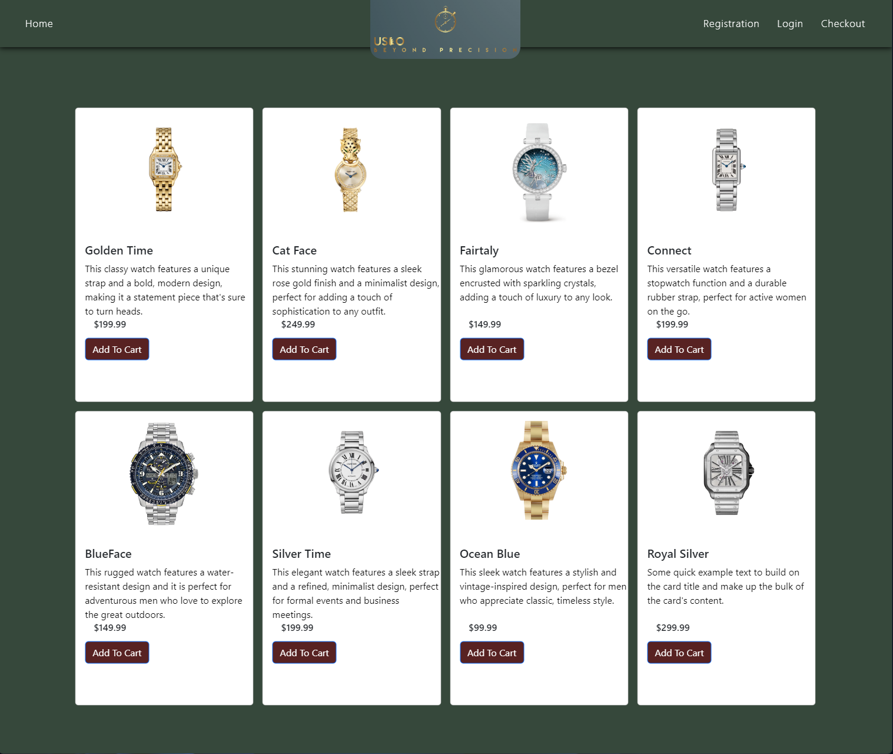
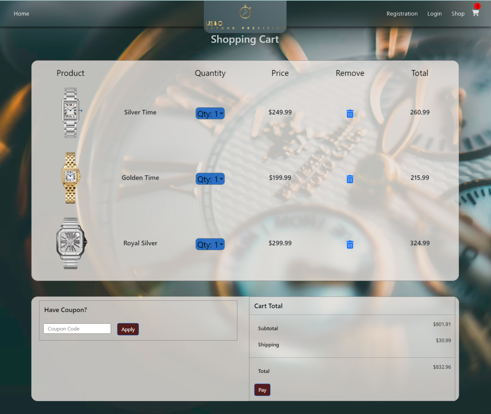

# Capstone-Usko-Watch

### This project is a website name "USKO", which means faith. The website feactures a collection of high-end, luxuriouse watches. It is developed using HTML, CSS, and Bootstrap. It consistes of five pages, including a home page that provides a brief introduction to the website, registration and login page, product pages, and a checkout page.
### One interesting piece of CSS I used is backdrop-filter:blur to creat a blurred background for div. This helps to maintain the focus on the content of the page and enhances the overall aesthetic appeal of the website. 

### Preview:

